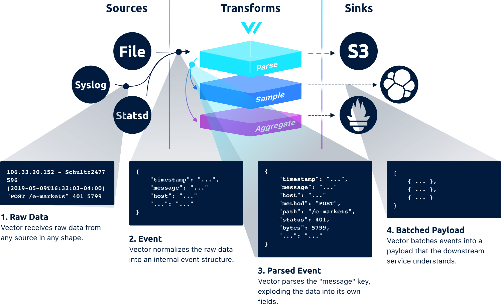

# Data Model



This page aims to provide a deeper dive into Vector's data model and how data flows through Vector internally. Understanding this goes a long way in properly [configuring](../usage/configuration/) Vector for your use case.

## Raw Data

The very initial shape of data is represented in its raw format. This could be any format and any shape, such as a Syslog line, a JSON object, or a Statsd metric. Once Vector receives the raw data, it proceeds to normalize it into an "[event](concepts.md#events)".

## Event

As outlined in the [concepts section](concepts.md), an "event" represents an individual unit of data that flows through Vector. An event must be one of two types: a [`log`](data-model.md#log) or a [`metric`](data-model.md#metric). Vector makes these classifications because each type has different requirements. For example, a `log` is flexible, sharing common keys but also allowing for additional keys, where a `metric` is much more defined in its shape, with labels and specific data types.

A [formal Protobuf definition](https://github.com/timberio/vector/blob/master/proto/event.proto) is available in Vector's source code, and each type is described in more detail below.

### Log

Vector characterizes a "log" as a structured event with keys representing the event's `timestamp`, `message`, `host`, and other properties. Vector takes an unopinionated approach to the event's shape, and does not require any specific keys. This is by design, as it reduces integration friction and allows Vector to be more transparent in your pipeline. Although, depending on the component, certain keys must be specified, and if left unspecified, Vector will default to a common schema that is shared across all components of Vector.

#### Default Schema

In all cases where a component must operate on a key, the following schema is used as the default. Each component will provide configuration options to override the keys used, if necessary.

```javascript
{
    "timestamp": 123,
    "message": "message"
    "host": "my.host.com"
}
```

| Name | Type | Description |
| :--- | :--- | :--- |
| `timestamp` | `string` | ISO 8601 timestamp representing when the log was generated. |
| `message` | `string` | String representation the log. This is the key used when ingesting data, and it is the default key used when parsing. |
| `host` | `string` | A string representing the originating host of the log. |

#### Nested Keys

For simplicity and performance reasons, Vector represents events as a flat map with `.` delimited keys that denote nesting:

```javascript
{
    "parent.child": "..."
}
```

This makes it _much_ easier and faster to work with nested documents within Vector. Before Vector encodes data and sends it downstream, Vector will explode out the map into nested keys:

```javascript
{
    "parent": {
        "child": "..."
    }
}
```

This ensures that the nested structure is preserved for your downstream services. Each [sink](../usage/configuration/sinks/) will document this behavior in a "Nested Documents" section, as well as any options to enable or disable it.

#### Type Conversion

It is possible for multiple `log` events to be reduced into one or more `metric` events.

### Metric

TODO: Fill in when the structure solidifies

#### Type Conversion

`metrics` event cannot convert to another other type, but they can be derived from `log` events.

## Batched Payload

Finally, before data is sent off to a downstream service from within a [sink](../usage/configuration/sinks/), it is transformed into a batched payload. Depending on the sink this could be small rapid batches, such as the [`tcp` sink](../usage/configuration/sinks/tcp.md), or large batches built over time, such as the [`aws_s3` sink](../usage/configuration/sinks/aws_s3.md). The encoding of the payload is dictated by the downstream service, if the service supports multiple encodings Vector will provide option to control this from within the sink.

