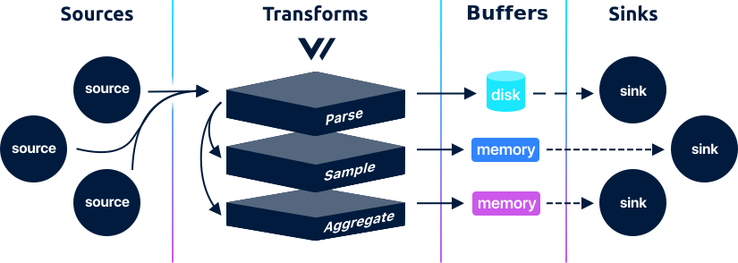

# \*.buffer



The `*.buffer` option allows you to configure each sink's buffer, as shown in the diagram above.

## Example



```coffeescript
[sinks.<sink-id>]
    type = "<sink-type>"
    # ...
    
    [sinks.<sink-id>.buffer]
        # REQUIRED
        type = "disk"
        when_full = "block"
        
        # OPTIONAL
        max_size = 2000000000 # 2gb in bytes
```



## Options

<table>
  <thead>
    <tr>
      <th style="text-align:left">Key</th>
      <th style="text-align:center">Type</th>
      <th style="text-align:left">Description</th>
    </tr>
  </thead>
  <tbody>
    <tr>
      <td style="text-align:left"><b>Required</b>
      </td>
      <td style="text-align:center"></td>
      <td style="text-align:left"></td>
    </tr>
    <tr>
      <td style="text-align:left"><code>type</code>
      </td>
      <td style="text-align:center"><code>string</code>
      </td>
      <td style="text-align:left">
        <p>The type of buffer.
          <br /><code>enum: &quot;memory&quot;, &quot;disk&quot;</code>
        </p>
        <p><code>default: &quot;memory&quot;</code>
        </p>
      </td>
    </tr>
    <tr>
      <td style="text-align:left"><code>when_full</code>
      </td>
      <td style="text-align:center"><code>string</code>
      </td>
      <td style="text-align:left">
        <p>The behavior when the buffer is full. See <a href="buffer.md#back-pressure-vs-load-shedding">Back Pressure vs. Load Shedding</a> for
          more info.
          <br /><code>enum: &quot;block&quot;, &quot;drop_newest&quot;</code>
        </p>
        <p><code>default: &quot;block&quot;</code>
        </p>
      </td>
    </tr>
    <tr>
      <td style="text-align:left"><b>Optional</b>
      </td>
      <td style="text-align:center"></td>
      <td style="text-align:left"></td>
    </tr>
    <tr>
      <td style="text-align:left"><code>max_size</code>
      </td>
      <td style="text-align:center"><code>int</code>
      </td>
      <td style="text-align:left">
        <p>Only relevant when <code>type</code> is <code>disk</code>. The maximum size
          of the buffer, in bytes, on the disk. See the <a href="buffer.md#options">How It Works section</a> below.</p>
        <p><code>no default</code>
        </p>
      </td>
    </tr>
    <tr>
      <td style="text-align:left"><code>num_items</code>
      </td>
      <td style="text-align:center"><code>int</code>
      </td>
      <td style="text-align:left">
        <p>Only relevant when <code>type</code> is <code>memory</code>. The maximum
          number of <a href="../../../about/concepts.md#records">records</a> allowed
          in the buffer.</p>
        <p><code>default: 500</code>
        </p>
      </td>
    </tr>
  </tbody>
</table>## Tuning

The point of the buffer is to allow for the ingress of data while sinks are intermittently busy or unavailable. As such, you'll want to make sure your buffers are large enough to accumulate data during this time period without disrupting service of the instance. This is highly dependent on your data volume and behavior of your downstream services. To simply how you think about this, we recommend aligning buffer limits to the maximum resource size you're willing to allocate to Vector for this purpose. The best way to determine this is to start low and monitor resource usage and performance. You can adjust these values and [reload Vector on the fly](../../administration/reloading.md) until you achieve the right setting.

## How It Works

Every sink buffers data in some way. For example, the [`s3` sink](aws_s3.md) usually creates large buffers, flushing over longer intervals, while the [`tcp` sink](tcp.md) builds very small buffers flushing as rapidly as possible. In both cases a buffer is used. This section will describe how Vector's buffers work so you can configure them appropriately.

### Coupled with sinks

Vector takes a different approach to buffers, coupling them with sinks instead of maintaining a single global buffer. This offers a number of benefits:

* Buffer cleanup can be synced with sink checkpoints, offering at-least once guarantees if the source/sink supports it.
* Buffer resumption is much more efficient since data does not have to go through the same processing again.
* It fits better into our [flexible pipeline syntax](../#pipelines) where pipelines can deviate from disparate transforms to different sinks.

### In-Memory

Vector can build a sink's buffer in-memory, which is the default. A memory buffer can be explicitly specified with the `type` option and its size is controlled by the `num_items` option.

#### Pros

* Fast

#### Cons

* Not be persisted across restarts.
* More expensive since RAM is generally more expensive than disk.

### On-Disk

Vector can build a sink's buffer on-disk, this must be explicitly turned by setting the `type` option to `disk`, its size can be controlled by the `max_size` option.

#### Pros

* Cheaper since RAM is not used.
* Will be persisted across restart.

#### Cons

* Slower. See [performance](buffer.md#performance) below.

#### Performance

Our benchmarks, which were run on a personal laptop with a modern SSD, show on-disk buffers to be about 3 times slower:

```text
buffers/in-memory       time:   [276.46 ms 281.38 ms 284.66 ms]         
                        thrpt:  [33.502 MiB/s 33.892 MiB/s 34.495 MiB/s]
buffers/on-disk         time:   [771.00 ms 820.59 ms 831.66 ms]         
                        thrpt:  [11.467 MiB/s 11.622 MiB/s 12.369 MiB/s]
buffers/on-disk (low limit)                                             
                        time:   [20.769 s 35.240 s 38.830 s]
                        thrpt:  [251.49 KiB/s 277.12 KiB/s 470.21 KiB/s]
```

You can see from the last benchmark that it's critically important your buffer is large enough. If your buffer is too small you will pay a large penalty constantly cleaning up the buffer. In general, we recommend an on-disk buffer be at least 2 times the size of the payload being built within the sink.

#### Protobuf

On-disk records are serialized via Vector's [`event` protobuf](https://github.com/timberio/vector/blob/master/proto/event.proto). The structure is versioned and is supported across _upgrades only_. If Vector encounters what appears to be corrupted records on-disk then they will be discarded.

#### LevelDB

Vector uses [LevelDB](https://github.com/google/leveldb) for `disk` based buffers since it allows for efficient ordering and cleanup.

### Back Pressure vs. Load Shedding

When the buffer is full, Vector defaults to applying back pressure via the [`when_full` option](buffer.md#options). This default helps to ensure you do not lose data. In some cases it is preferable to shed load, which ensures performance is not disrupted when the buffer is full. This option drops new records as they are received until the buffer has room again. This can be enabled by setting the `when_full` option to `"drop_newest"`.

