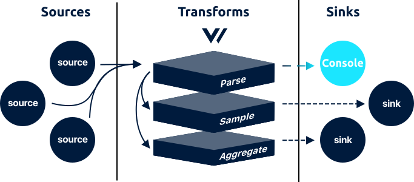

# console sink



The `console` sink prints [`log`](../../../about/data-model.md#log) and [`metric`](../../../about/data-model.md#metric) events to [`STDOUT`](https://en.wikipedia.org/wiki/Standard_streams#Standard_output_%28stdout%29) or [`STDERR`](https://en.wikipedia.org/wiki/Standard_streams#Standard_error_%28stderr%29). This is useful for testing, debugging, or piping Vector's output to another command.

## Example



```coffeescript
[sinks.<sink-id>]
    # REQUIRED
    inputs = ["{<source-id> | <transform-id>}", [ ... ]]
    type   = "console"
    
    # OPTIONAL
    encoding = "text"
    target   = "stdout"
```



## Options

<table>
  <thead>
    <tr>
      <th style="text-align:left">Key</th>
      <th style="text-align:center">Type</th>
      <th style="text-align:left">Description</th>
    </tr>
  </thead>
  <tbody>
    <tr>
      <td style="text-align:left"><b>OPTIONAL</b>
      </td>
      <td style="text-align:center"></td>
      <td style="text-align:left"></td>
    </tr>
    <tr>
      <td style="text-align:left"><code>encoding</code>
      </td>
      <td style="text-align:center"><code>string</code>
      </td>
      <td style="text-align:left">
        <p>How records should be encoded. See <a href="console.md#encoding">Encoding</a> for
          more info.
          <br /><code>enum: &quot;text&quot;, &quot;json&quot;</code>
        </p>
        <p><code>no default</code>
        </p>
      </td>
    </tr>
    <tr>
      <td style="text-align:left"><code>target</code>
      </td>
      <td style="text-align:center"><code>string</code>
      </td>
      <td style="text-align:left">
        <p>The stream to write to. Must be one of <code>stdout</code> or <code>stderr</code>.
          <br
          /><code>enum: &quot;stdout&quot;, &quot;stderr&quot;</code>
        </p>
        <p><code>default: &quot;stdout&quot;</code>
        </p>
      </td>
    </tr>
  </tbody>
</table>## Input

The `console` sink accepts both [`log`](../../../about/data-model.md#log) and [`metric`](../../../about/data-model.md#metric) events from a [source](../sources/) or [transform](../transforms/).

## Output

The `console` sink will print individual events to the specified `target`. The encoding is dictated by the `encoding` option \(see [Encoding](console.md#encoding)\), each encoding is demonstrated below:



```text
30.163.82.140 - Stracke8362 914 [2019-05-15T11:17:57-04:00] "GET /roi/evolve/embrace/transparent" 504 29763
190.218.92.219 - Wiza2458 775 [2019-05-15T11:17:57-04:00] "PUT /value-added/b2b" 503 9468
43.246.221.247 - Herman3087 294 [2019-05-15T11:17:57-04:00] "DELETE /reinvent/interfaces" 503 9700
```



```javascript
{"timestamp": 1557932537, "message": "GET /roi/evolve/embrace/transparent", "host": "Stracke8362", "process_id": 914, "remote_addr": "30.163.82.140", "response_code": 504, "bytes": 29763} 
{"timestamp": 1557933548, "message": "PUT /value-added/b2b", "host": "Wiza2458", "process_id": 775, "remote_addr": "30.163.82.140", "response_code": 503, "bytes": 9468}
{"timestamp": 1557933742, "message": "DELETE /reinvent/interfaces", "host": "Herman3087", "process_id": 775, "remote_addr": "43.246.221.247", "response_code": 503, "bytes": 9700}
```



## How It Works

### Encoding

The `console` sink encodes [events](../../../about/data-model.md#event) before printing them them. Each type is described in more detail below.

#### text

When encoding [events](../../../about/data-model.md#event) to `text` Vector will submit the `"message"` field only.

#### json

When encoding events to `json`, Vector will encode the entire [event](../../../about/concepts.md#events) to JSON.

#### nil \(default\)

If left unspecified, Vector will dynamically choose the appropriate encoding. If an [event](../../../about/concepts.md#events) is explicitly structured then it will be encoded as `json`, if it is not, it will be encoded as `text`. This provides the path of least surprise for different [pipelines](../../../about/concepts.md#pipelines).

For example, take the simple [`tcp` source](../sources/tcp.md) to `console` sink pipeline. The data coming from the `tcp` source is raw text lines, therefore, if you connected it directly to this sink you would expect to see those same raw text lines. Alternatively, if you parsed that data with a [transform](../transforms/), you would expect to see encoded structured data.

### Streaming

Data is streamed in a real-time, per-record basis. It is not batched.

## Resources

* [Source code](https://github.com/timberio/vector/blob/master/src/sinks/console.rs)
* [Issues](https://github.com/timberio/vector/labels/Sink%3A%20Console)


