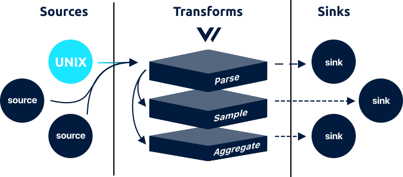

# unix source



The `unix` source allows you to ingest [`log`](../../../about/data-model.md#log) events over a [Unix domain socket](https://en.wikipedia.org/wiki/Unix_domain_socket).

## Example



```coffeescript
[sources.<source-id>]
    # REQUIRED
    type = "unix"
    path = "/path/to/socket"
    
    # OPTIONAL
    max_length = 2048
    peer_path_key = "peer_path"
```



## Options


<table>
  <thead>
    <tr>
      <th style="text-align:left">Key</th>
      <th style="text-align:center">Type</th>
      <th style="text-align:left">Description</th>
    </tr>
  </thead>
  <tbody>
    <tr>
      <td style="text-align:left"><b>REQUIRED</b>
      </td>
      <td style="text-align:center"></td>
      <td style="text-align:left"></td>
    </tr>
    <tr>
      <td style="text-align:left"><code>path</code>
      </td>
      <td style="text-align:center"><code>string</code>
      </td>
      <td style="text-align:left">
        <p>The path to the Unix socket.</p>
        <p><code>example: /tmp/p0fsock</code>
        </p>
      </td>
    </tr>
    <tr>
      <td style="text-align:left"><b>OPTIONAL</b>
      </td>
      <td style="text-align:center"></td>
      <td style="text-align:left"></td>
    </tr>
    <tr>
      <td style="text-align:left"><code>max_length</code>
      </td>
      <td style="text-align:center"><code>int</code>
      </td>
      <td style="text-align:left">
        <p>The maximum length, in bytes, that a single message can be. If exceeded,
          the message will be discarded.</p>
        <p><code>default: 102400</code> (100 mib)</p>
      </td>
    </tr>
    <tr>
      <td style="text-align:left"><code>peer_path_key</code>
      </td>
      <td style="text-align:center"><code>string</code>
      </td>
      <td style="text-align:left">
        <p>The key name to use for the socket path context. See <a href="unix.md#context">Context</a> for
          more info.</p>
        <p><code>default: &quot;peer_path&quot;</code>
        </p>
      </td>
    </tr>
  </tbody>
</table>## Output

The `unix` source outputs [`log`](../../../about/data-model.md#log) events with the following [default schema](../../../about/data-model.md#default-schema):



```javascript
{
    "timestamp": "<timestamp>",
    "message": "<line>"
    "peer_path": "<socket-path>"
}
```



## How It Works

### Context

Each line is augmented with the following context key:

* `"peer_path"` - The path of the unix socket.

The key name can be changed with the [Context options](unix.md#options). An example can be seen in the [Output section](unix.md#output).

### Guarantees

The `unix` source is capable of achieving an [**at least once delivery guarantee**](../../../about/guarantees.md#at-least-once-delivery) if your [pipeline is configured to achieve this](../../../about/guarantees.md#at-least-once-delivery).

### Line Delimiters

Each line is read until a new line delimiter \(the `0xA` byte\) is found.

